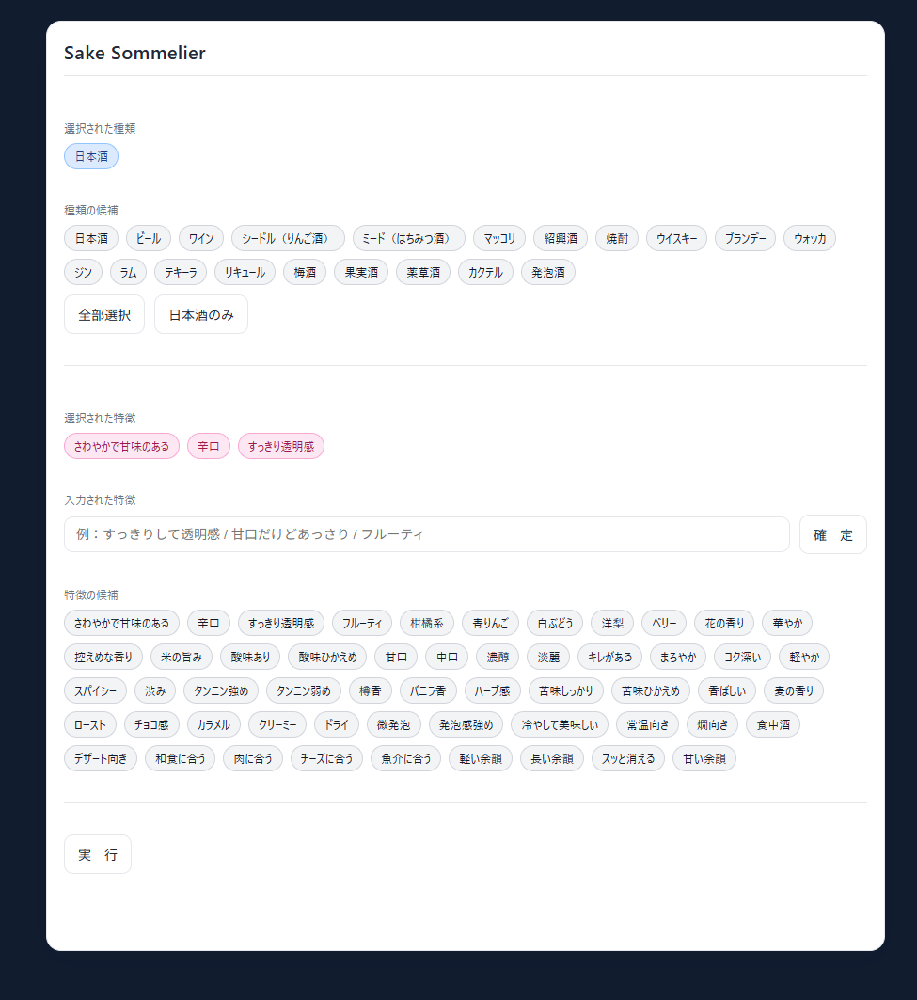
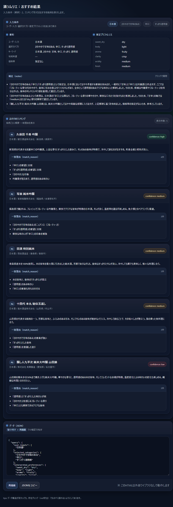

# 酒ソムリエ（Sake Sommelier）

酒ソムリエは、ユーザーが指定した「酒の種類」と「特徴」をもとに、
AI（Gemini）を用いておすすめのお酒を提案するアプリケーションです。

本アプリは **試作版（プロトタイプ）** です。
完璧な動作や完成された UI を保証するものではありません。

---

## スクリーンショット

### 入力画面



### おすすめ酒一覧（出力画面）



---

## 注意事項（重要）

- 本アプリは試作版です
  - 不具合が発生する可能性があります
  - UI・仕様は予告なく変更されることがあります
- AI（Gemini）を利用しているため、入力内容によっては
  意図しない回答が返る場合があります

---

## 動作概要

- 本アプリは **コンソールアプリケーション** です
- 起動すると **HTTP サーバーとして動作**し、
  Web ブラウザから操作します
- ユーザー入力をもとに、
  おすすめのお酒一覧ページを生成・表示します

---

## 起動方法

### 起動コマンド

```
SakeSommelier.exe /P <ポート番号> /K <GeminiAPIキー>
```

### 引数の説明

- `/P <ポート番号>`
  - HTTP サーバーとして待ち受けるポート番号
  - **省略時は 80**
- `/K <GeminiAPIキー>`
  - Gemini API の API キー
  - **省略不可**

---

## サーバーの停止方法

```
SakeSommelier.exe /S
```

---

## 使い方

サーバーを起動したらブラウザで開いてみて下さい。
例えば、http://localhost など

### 酒の種類・特徴の選択

- 酒の種類：**1つ以上必須**
- 特徴：**1つ以上必須**

### 自由入力について

- 自由な言葉で特徴を追加できます
- 味・香り・飲み口など、お酒の印象を意識してください
- 支離滅裂な文章は、AIの回答精度を下げる場合があります

---

## Gemini API キーについて

Gemini API の利用には、将来的に課金が発生する可能性があります。
API 利用および課金管理は **ユーザー自身の責任**で行ってください。

---

## 免責事項

本アプリの利用によって生じたいかなる損害についても、
作者は一切の責任を負いません。
